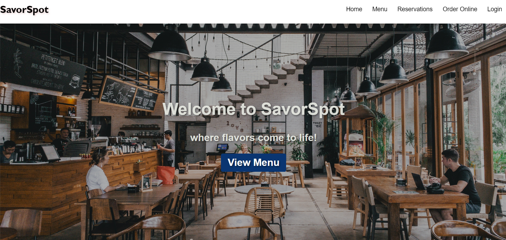
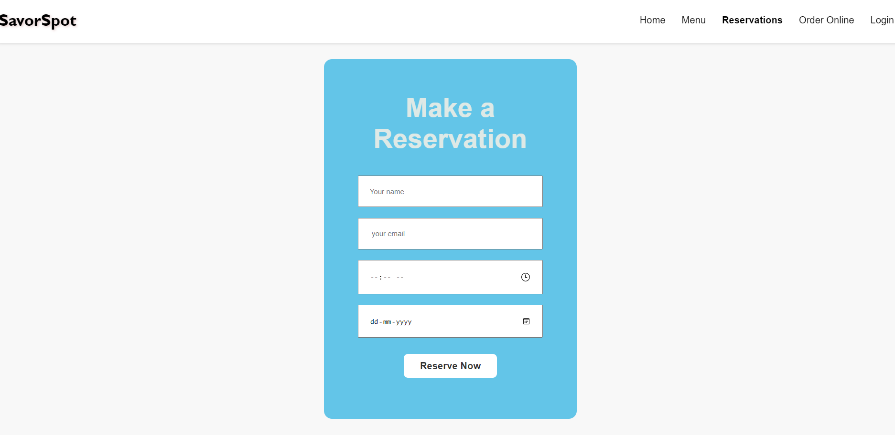
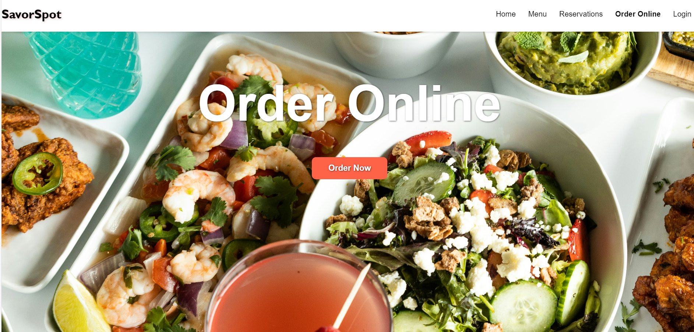

 🍽️ PRODIGY_WD_01 – Responsive Restaurant Website

This project is a part of the Prodigy Internship (Task-01). It showcases a responsive and modern restaurant website built using HTML, CSS, and JavaScript. The website includes essential features such as an interactive menu, reservation form, online ordering system, and user login page—all wrapped in a sleek, user-friendly design.

📌 Project Features

🏠 Landing page with fixed navigation

🧾 Menu page displaying food categories

📅 Table reservation form

🛒 Online order section

🔐 Login functionality (UI only)

📱 Fully responsive design for all devices

🛠️ Technologies Used

HTML5 – Structure of the webpage  
CSS3 – Styling and layout  
JavaScript – Interactive features  

📸 Screenshots

🖼️ Homepage  

🍕 Menu Page  

📅 Reservation form

🛒 Online order

🔐 Login Page

🚀 Getting Started

To view this project locally:

bash
 
Clone the repository:
 
    git clone https://github.com/shipali-k-account/PRODIGY_WD_01.git

Navigate into the project directory:

    cd PRODIGY_WD_01

Open index.html in your preferred browser
